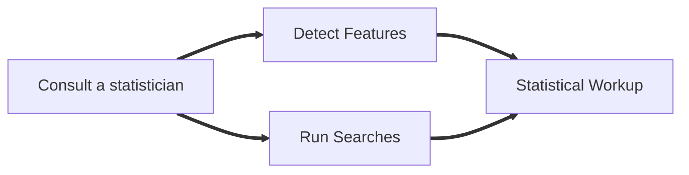

# Getting Started

Top-down proteomics informatics is a complicated subject that, like most things, builds on many simpler concepts that evolved over time. This guide looks at that evolution through the lens of sample complexity; more complicated samples require more experimental preparation and additional informatics considerations. Let us begin with understanding what a proteoform looks like by mass spectrometry.

## Single known proteoform

Imagine the simplest proteomics sample possible: a single [proteoform](https://www.ncbi.nlm.nih.gov/pmc/articles/PMC4114032/) all by itself.
It's not quite clear why you would be doing this (see possible examples), but you have none the less [directly infused](/docs/basics/samples-to-instrument) this sample and acquired a single [spectrum](https://en.wikipedia.org/wiki/Mass_spectrum) showing many copies of the same intact proteoform. Because of electrospray ionization [ESI](https://en.wikipedia.org/wiki/Electrospray_ionization), the proteoform molecules are distributed among many different charge states. Your intact proteoform spectrum (aka MS1) might look something like this:

import Plot from 'react-plotly.js';
import ubsimple from './ubiquitin-simple.json'; 

<Plot
      data={ubsimple.data} 
      layout={ubsimple.layout} 
    />

This spectrum shows an [isotopically resolved](/docs/basics/spectra) example of ubiquitin with no impurities. We can confirm this by [estimating the observed proteoform mass](/docs/Theory/manual-deconvolution) and comparing it to the [theoretical proteoform mass](/docs/Theory/mass-protein). Wait, you think a mass alone is flimsy evidence? You don't believe me? 😲 Fine, let's use [fragmentation](/docs/Theory/fragmentation) to break apart all the copies of ubiquitin in our sample and confirm the sequence we are seeing. A [fragment map](/docs/Theory/fragment-map) (below) shows where the different molecules broke apart and we were able to observe the pieces.

Naïvely, one could simply count the number of matchings fragment to get a sense of how good this match is. However, we can also use a variety of metrics and [scores](/docs/basics/coverage-scores) that take more factors into account (e.g. Percent of fragments explained, Percent of backbone bonds cleaved, etc.).

## Single known gene

OK, let's up the ante: we still know the [gene](https://en.wikipedia.org/wiki/Gene), but now there are multiple proteoforms involved. This could be an actual experiment, where you'd like to understand the [proteoform family](https://www.ncbi.nlm.nih.gov/pmc/articles/PMC4917391/) membership and perhaps some notion of quantitation. In many cases, the intact proteoform spectrum will be enough to give us a good idea of the proteoform landscape. In the example below, we have 2 charge state distributions that correspond to 2 proteoforms.

import ubtwo from './ubiquitin-two.json'; 

<Plot
      data={ubtwo.data} 
      layout={ubtwo.layout} 
    />

Wow, that's starting to look a bit muddled with all those peaks! Let's run a [deconvolution](/docs/deconvolution/introduction) algorithm on the spectrum to both decharge and deisotope those proteoforms.

import ubmass from './ubiquitin-mass.json'; 

<Plot
      data={ubmass.data} 
      layout={ubmass.layout} 
    />

Much better. It is now clear that we have 2 proteoforms that are ~80 [Daltons](https://en.wikipedia.org/wiki/Dalton_(unit)) apart. Given prior knowledge about this gene and our sample, we have a pretty good idea that this is a phosphorylation. Wait, what? You don't believe me again? 😲 Fear not, fragmentation can again provide confidence in our assignment. With a mass spectrometer, it is possible to [isolate](/docs/basics/mass-spectrometer) a portion of a spectrum and only pass it through for fragmentation. After isolating the heavier proteoform, fragmenting, and running [deconvolution](/docs/deconvolution/introduction) on the fragmentation spectrum (aka MS2), we are able to see the modification clearly.

At this point, you can also start to think about how the abundances of these proteoforms relate to each (aka relative quantitation or quantification). While there are some [complications](/docs/basics/quantitation) to be aware of, typically the abundance (or intensity) of the proteoforms after deconvolution can be used for comparisons. In our example above, the unmodified proteoform is about twice as abundant as the modified one (meaning that our sample had roughly double the number of unmodified proteoform molecules).

## Multiple known genes

:::note[Examples]

- Compare proteoform families
- Complex standard (e.g. [Pierce Intact Protein Standard Mix](https://assets.thermofisher.com/TFS-Assets/LSG/manuals/MAN0016725_PierceIntactProteinStandardMix_PI.pdf))

:::

Time to move on to bigger (and possibly better) things! In this sample, we have a mixture of genes that we know, but we aren't sure what proteoforms are around. In addition, we suspect that some proteoforms are [endogenously processed](__FIX__) and, consequently, are smaller than the ["base" proteoform](/docs/basics/proteoform-families). Below, we show an examples of m/z and deconvoluted intact spectra that contain 3 hemoglobin genes (alpha, beta, and delta).

import hemoglobinmz from './hemoglobin-mz.json';
import hemoglobinmass from './hemoglobin-mass.json';

<Plot
      data={hemoglobinmz.data} 
      layout={hemoglobinmz.layout} 
    />

<Plot
    data={hemoglobinmass.data} 
    layout={hemoglobinmass.layout} 
/>

Clearly, the intact masses alone are not enough to determine which proteoforms are present. So, we must isolate and fragment each of these targets in turn and [generate fragment maps](/docs/identification/targeted/applications) using all of the known gene sequences. We are able to figure out 4 out of the 5 peaks because they match well to one of the three sequences, but the smallest peak (around 10 kDa) only matches on one end (aka [terminus](https://en.wikipedia.org/wiki/N-terminus)).

In this case we are lucky (thank the demonstration gods!). Because the fragmentation is only supporting one termini, we correctly guess that this is a subsequence and start removing amino acids from the opposite termini until we get good agreement with the intact mass from deconvolution and the fragment map improves (The initiator methionine is another good indicator that the subsequence is correct).

<!-- https://pslite.proteinaceous.net/?result=4r7wbuwn -->

But, I hear you ask ... what if we aren't that lucky? ... more on that later.

## Single unknown proteoform

Thus far we have been careful to maintain a high level of certainty about our samples. However, life isn't always that easy! Let's add some uncertainty to things and explore how we might face an unknown single proteoform.

### Example 1 - We know the sample's organism and it's a common organism

Got a mystery proteoform that came out of a mouse? You're in luck! The typical workflow involves [creating a database](/docs/identification/create-database) from a [trusted source](/docs/identification/database-sources) and running a [search algorithm](/docs/identification/search/applications) to find the best couple of matches. Given the small scale of a single proteoform, you can manually validate the fragment maps and pick the best result.

:::warning[Possible Example]
TopPIC result with a couple hits.
:::

### Example 2 - We know the sample's organism and it's an uncommon organism

Got a mystery proteoform that came out of a woolly mammoth? This might be a bit harder. You might be able to use a database from a similar species (maybe African Elephant?) and find some matches. Do you happen to have a set of DNA or RNA sequences? These can be [turned into a proteomic search](/docs/basics/dna-rna) space without much difficulty. Is your fragmentation fantastic? Try the next example ...

:::warning[Possible Example]
Something to show RNA -> AA?
:::

### Example 3 - We can't get a database, but the fragmentation is amazing!

This can happen in very novel cases or perhaps in the case of antibodies, where the proteoform's sequence isn't determined by the genome. While it is difficult for top-down data, if you have very rich fragmentation, you can give [*de novo*](/docs/basics/de-novo) sequencing a try.

:::warning[Possible Example]
Something from a de novo paper?
:::

## Multiple unknown proteoforms

Let's bring a couple more unknown proteoforms to the party!

Although we skipped right past it before, the hardest part about dealing with multiple unknowns is formatting your observation data into a something that the search algorithms can handle. This typically means that a single instrument acquisition will have both intact and fragmentation scans that are brought together by the software. If your data are in multiple files you might be out of luck.

:::warning[Possible Example]
Maybe some snake venom?
:::

- Isolation of interesting peaks and manually put together features with fragments

## Complex mixture of unknown proteoforms

At this point, your sample contains hundreds or thousands of the proteoforms and is WAY too complex to directly introduce to a mass spectrometer. At the very least, you will need to [space the proteoforms out over time](/docs/basics/chromotagraphy) so they don't hit the instrument in one big glob. If the complexity is high enough, you should consider splitting your sample into [multiple simpler mixtures](/docs/basics/prefractionation) (by mass, collisional cross-section, etc.) before you get onto the instrument. Below is an example of a chromatogram that shows scan intensity over time.

:::warning[TODO]
Example of chromatogram
:::

This is also the first time that we have more data than we can manually validate. [Feature Detection](/docs/identification/feature-detection) algorithms will scan your instrument data file and find proteoform signals within the chromatographic peaks. Features and their corresponding deconvoluted fragment masses are searched in an automated fashion against a [database](/docs/basics/create-database) to produce a list of potential proteoforms in your sample.

:::warning[TODO]
Example of proteins and proteoforms in TDviewer
:::

This last point is crucial: there is no way anyone has time to properly validate the thousands of potential proteoform results from these searches! To address this, most search algorithms include additional scores that take the broader context of the search into account (database size, search parameters, etc.). The best approach attempts to estimate a [false discovery rate (FDR)](/docs/identification/discovery/fdr) by comparing the proteoform results to the scores from fake (or decoy) proteoforms.

:::warning[TODO]
Target/Decoy distribution plot
:::

## Multiple samples of known proteoforms

Wow, let's stop to catch of breath, this is a lot of stuff! OK, that's enough resting ... keep moving. Let's do multiple simple samples in a single experiment. This kind of experiment is usually involved in the development and execution of proteoform assays.

:::warning[TODO]
Example of PfRM
:::

## Multiple samples of complex mixtures

The final stop on this journey is of most complex: multiple complex mixtures. This is wading into the world of full proteome quantitation and more advanced statistics. The workflow consists should look something like the following.

